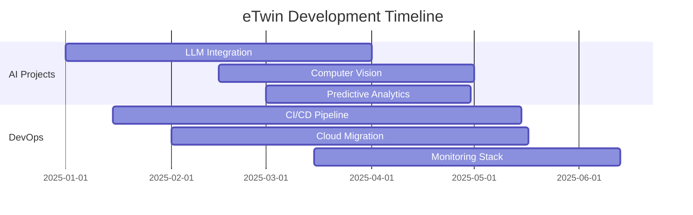

<h1 align="center">
  

  
  
  

  
  
  
  

  
  
  

---

## 🏢 About eTwin Technology

**eTwin Technology** is a premier digital innovation hub specializing in **AI-driven software development**, **cloud-native solutions**, and **DevOps transformation**. We empower businesses with cutting-edge technology to thrive in the digital era.

### 🎯 Our Mission
> Accelerate digital transformation through innovative software solutions, artificial intelligence, and robust DevOps practices that deliver measurable business value.

---

## 🌟 Our Expertise

| **Software Engineering** | **AI & Machine Learning** | **Cloud & DevOps** |
| :--- | :--- | :--- |
| Full-Stack Development | Generative AI | Cloud Architecture |
| Microservices | Computer Vision | CI/CD Automation |
| Mobile Applications | NLP & LLMs | Infrastructure as Code |
| Real-time Systems | Predictive Analytics | Container Orchestration |
| API Development | AI Integration | Site Reliability Engineering |

---

## 🛠️ Technology Stack

### 🎨 **Frontend & UI/UX**

  

### ⚙️ **Backend & APIs**

  

### 🗄️ **Databases & Storage**

  

### 🤖 **AI & Machine Learning**

  
   
  
  
  
  

### ☁️ **Cloud & DevOps**

  

### 🛡️ **Security & Monitoring**

  
   
  
  

---

## 🚀 Development Workflow

```mermaid
graph LR
    A[Ideation & Planning] --> B[AI-Powered Prototyping]
    B --> C[Cloud-Native Development]
    C --> D[CI/CD Automation]
    D --> E[AI Model Integration]
    E --> F[Security Scanning]
    F --> G[Container Orchestration]
    G --> H[Monitoring & Observability]
    H --> I[Continuous Optimization]
```

---

## 🏗️ Our Architecture Principles

  
  

- **🔬 AI-First Approach**: Integrate intelligence at every layer
- **☁️ Cloud-Native**: Leverage cloud capabilities fully
- **📦 Microservices**: Scalable, maintainable architecture
- **🔐 Security by Design**: Proactive threat mitigation
- **⚡ Performance Optimization**: Real-time monitoring & optimization
- **♻️ DevOps Culture**: Collaboration & automation

---

## 📊 GitHub Stats & Metrics

  
  
  
  
  
  
  

---

## 📈 Activity Visualization

---

## 🏆 Featured Projects

  
  | **AI Solutions** | **DevOps Tools** | **Web Platforms** |
  | :--- | :--- | :--- |
  | 🧠 Smart Chatbots | ⚙️ Auto-Scaling CI/CD | 🌐 Enterprise Portals |
  | 👁️ Vision Systems | 📊 Monitoring Dashboards | 🛒 E-commerce Suites |
  | 📝 Document AI | 🔒 Security Automation | 📱 Progressive Web Apps |
  | 🤖 Process Automation | ☁️ Infrastructure Templates | 🎯 Real-time Dashboards |

---

## 🤝 Let's Collaborate

We're always open to exciting partnerships and innovative projects!

  
  
  

  

---

## 🌐 Connect With Us

  
  
  
  
  

---

  
  
  
  ### **💫 Innovating Today for Tomorrow's Digital Landscape**
  
  

    
    
    
  

  
  **© 2025 eTwin Technology | Digital Innovation Hub | All Rights Reserved**
  

