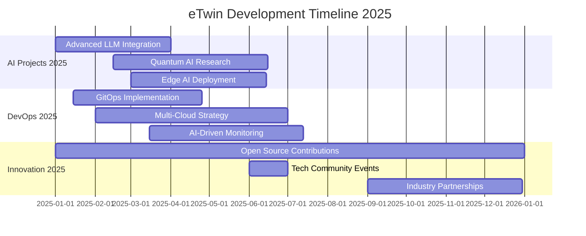

<h1 align="center">
  
</p>

<div align="center">
  
  
  
</div>

<p align="center">
  
  
  
  
</p>

<div align="center">
  
  
  
</div>

---

## 🏢 About eTwin Technology

**eTwin Technology** is a premier digital innovation hub specializing in **AI-driven software development**, **cloud-native solutions**, and **DevOps transformation**. We empower businesses with cutting-edge technology to thrive in the digital era.

### 🎯 Our Mission
> Accelerate digital transformation through innovative software solutions, artificial intelligence, and robust DevOps practices that deliver measurable business value.

---

## 🌟 Our Expertise

<div align="center">

| **Software Engineering** | **AI & Machine Learning** | **Cloud & DevOps** |
| :--- | :--- | :--- |
| Full-Stack Development | Generative AI | Cloud Architecture |
| Microservices | Computer Vision | CI/CD Automation |
| Mobile Applications | NLP & LLMs | Infrastructure as Code |
| Real-time Systems | Predictive Analytics | Container Orchestration |
| API Development | AI Integration | Site Reliability Engineering |

</div>

---

## 🛠️ Technology Stack

### 🎨 **Frontend & UI/UX**
<p align="center">
  
</p>

### ⚙️ **Backend & APIs**
<p align="center">
  
</p>

### 🗄️ **Databases & Storage**
<p align="center">
  
</p>

### 🤖 **AI & Machine Learning**
<p align="center">
  
  <br>
  
  
  
  
</p>

### ☁️ **Cloud & DevOps**
<p align="center">
  
</p>

### 🛡️ **Security & Monitoring**
<p align="center">
  
  <br>
  
  
</p>

---

## 🚀 Development Workflow

```mermaid
graph LR
    A[Ideation & Planning] --> B[AI-Powered Prototyping]
    B --> C[Cloud-Native Development]
    C --> D[CI/CD Automation]
    D --> E[AI Model Integration]
    E --> F[Security Scanning]
    F --> G[Container Orchestration]
    G --> H[Monitoring & Observability]
    H --> I[Continuous Optimization]
```



---

## 🏗️ Our Architecture Principles

<div align="center">
  
  

</div>

- **🔬 AI-First Approach**: Integrate intelligence at every layer
- **☁️ Cloud-Native**: Leverage cloud capabilities fully
- **📦 Microservices**: Scalable, maintainable architecture
- **🔐 Security by Design**: Proactive threat mitigation
- **⚡ Performance Optimization**: Real-time monitoring & optimization
- **♻️ DevOps Culture**: Collaboration & automation

---

## 📊 GitHub Stats & Metrics

<div align="center">
  
  <!-- GitHub Stats Cards - CORRECTED VERSION -->
  <a href="https://github.com/etwin-technology">
    
  </a>
  <a href="https://github.com/etwin-technology">
    
  </a>
  
  <!-- GitHub Streak Stats -->
  <a href="https://github.com/etwin-technology">
    
  </a>
  
  <!-- GitHub Contribution Graph -->
  
  
  <!-- GitHub Trophy -->
  <a href="https://github.com/etwin-technology">
    
  </a>
  
  <!-- GitHub Metrics -->
  
  
</div>

---

## 📈 Activity Visualization



---

## 🏆 Featured Projects

<div align="center">
  
  <!-- Project Cards with Links -->
  <a href="https://github.com/etwin-technology/ai-platform">
    
  </a>
  <a href="https://github.com/etwin-technology/devops-toolkit">
    
  </a>
  <br>
  <a href="https://github.com/etwin-technology/cloud-architecture">
    
  </a>
  <a href="https://github.com/etwin-technology/web-framework">
    
  </a>

</div>

---

## 🔗 Useful Links

<div align="center">
  
  | **Category** | **Links** |
  | :--- | :--- |
  | **📚 Documentation** | [Getting Started](https://docs.etwin.tech) • [API Reference](https://api.etwin.tech) • [Tutorials](https://learn.etwin.tech) |
  | **🔧 Tools** | [DevOps Dashboard](https://tools.etwin.tech) • [Code Quality](https://quality.etwin.tech) • [AI Playground](https://ai.etwin.tech) |
  | **🌐 Community** | [Discussions](https://github.com/etwin-technology/discussions) • [Issues](https://github.com/etwin-technology/.github/issues) • [Blog](https://blog.etwin.tech) |
  | **📊 Metrics** | [Project Status](https://status.etwin.tech) • [Performance](https://perf.etwin.tech) • [Security](https://security.etwin.tech) |

</div>

---

## 🤝 Let's Collaborate

We're always open to exciting partnerships and innovative projects!

<div align="center">
  
  [](mailto:contact@etwin.tech)
  [](https://github.com/etwin-technology/.github/issues)
  [](https://discord.gg/etwin)
  [](https://calendly.com/etwin-tech)
  
</div>

---

## 🌐 Connect With Us

<p align="center">
  <a href="https://etwin.tech">
    
  </a>
  <a href="mailto:contact@etwin.tech">
    
  </a>
  <a href="https://github.com/etwin-technology">
    
  </a>
  <a href="https://linkedin.com/company/etwin-technology">
    
  </a>
  <a href="https://twitter.com/etwin_tech">
    
  </a>
</p>

---

<div align="center">
  
  
  
  ### **💫 Innovating Today for Tomorrow's Digital Landscape**
  
  <p align="center">
    
    
    
    
  </p>
  
  **© 2025 eTwin Technology | Digital Innovation Hub | All Rights Reserved**
  
  <sub>Last Updated: January 2025 | Version 2.0 | 🚀 Building the Future</sub>
  
</div>
```


